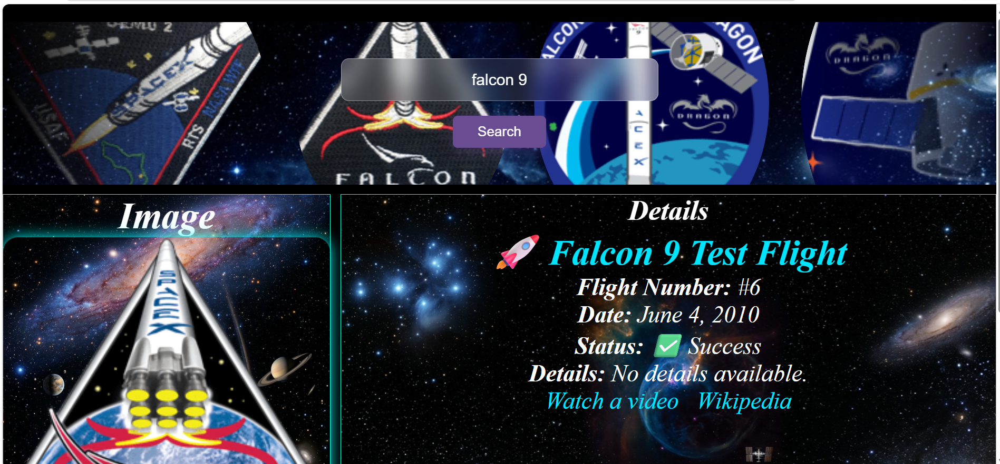

# Exploring the Galaxy

### Camper:
* **Name:** Selvin Eladio Lem Ical

---

## Project Description
A site to be able to learn a little more about SpaceX space launches, the details, dates, whether they were successful or not, briefly, a little of their stories.

### Used API:
This application consumes data from the API: **SpaceX**
* **Oficial Documentation:** https://api.spacexdata.com/v4/launches

---

## Preview
Below is a screenshot of the application in operation:

---

## Execution Instructions
Sigue estos pasos para ejecutar el proyecto en tu entorno local:

1. **Clone or download** this repository to your computer.
2. Locate the main file called `index.html` in the root folder.
3. **Open the `index.html` file** directly in any modern web browser (Chrome, Firefox, Brave, Edge).

---

### Used Technologies:
* HTML5 / CSS3
* JavaScript (ES6+)
* API: spaceX